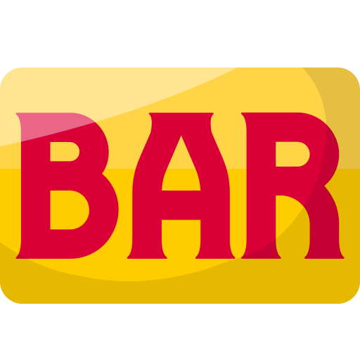

# Slot

Pixi.js를 사용하여 간단하게 슬롯을 구현하여 보았습니다.

### [데모](https://wkdgns135.github.io/Slot/)

## 게임 소개

시작 시 총 1000 골드가 주어지며 SPIN 버튼을 눌러 100골드를 사용하여 슬롯을 한번 돌릴 수 있습니다. 
슬롯의 결과에 따라 골드가 주어지며 족보는 다음과 같습니다.

<table>
  <thead>
    <tr>
      <th colspan="3">심볼</th>
      <th>배율</th>
    </tr>
  </thead>
  <tbody>
    <tr>
      <td>
        
      </td>
      <td>
        
      </td>
      <td>
        
      </td>
      <td>x77</td>
    </tr>
        <tr>
      <td>
        
      </td>
      <td>
        
      </td>
      <td>
        
      </td>
      <td>x30</td>
    </tr>
            <tr>
      <td>
        
      </td>
      <td>
        
      </td>
      <td>
        
      </td>
      <td>x20</td>
    </tr>
            <tr>
      <td>
        
      </td>
      <td>
        
      </td>
      <td>
        
      </td>
      <td>x10</td>
    </tr>
            <tr>
      <td>
        
      </td>
      <td>
        
      </td>
      <td>
        
      </td>
      <td>x5</td>
    </tr>
                <tr>
      <td colspan = 3>
        
      </td>
      <td>x2</td>
    </tr>
  </tbody>
</table>

## RTP(Return to Player)

기성 온라인 슬롯 게임에서의 RTP가 90~96% 사이라 하여 90.25%의 값이 나오도록 RTP를 설정하였습니다. 
각 심볼의 등장 확률은 다음과 같습니다.

<table>
    <tr>
        <td align="center"><b>심볼</b></th>
        <td>
            
          </td>
          <td>
            
          </td>
          <td>
            
          </td>
          <td>
            
          </td>
          <td align="center">
            
          </td>
    </tr>
    <tr>
        <td align="center"><b>확률</b></th>
        <td align="center">10%</td>
        <td align="center">15%</td>
        <td align="center">20%</td>
        <td align="center">25%</td>
        <td align="center">30%</td>
    </tr>
    <tr>
        <td align="center"><b>RTP</b></th>
            <td align="center">7.7%</td>
            <td align="center">10.13%</td>
            <td align="center">16%</td>
            <td align="center">15.165%</td>
        <td align="center">13.5% + 27.3%</td>
    </tr>
</table>

## 랜덤 선택 함수

  스핀 버튼을 누름과 동시에 정해진 확률에 따라 각 릴에 멈추게 될 심볼이 정해집니다. 
심볼을 선택할때에는 현재 시간(ns)를 시드로 사용하는 PRNG를 생성하는 함수를 구현하여 가중치에 따라 랜덤하게 배열에서 심볼을 하나 선택합니다.
